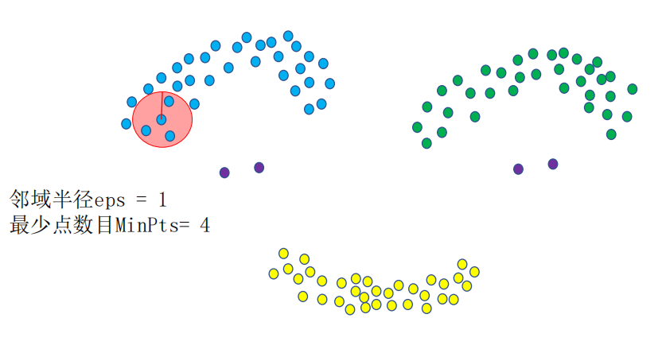
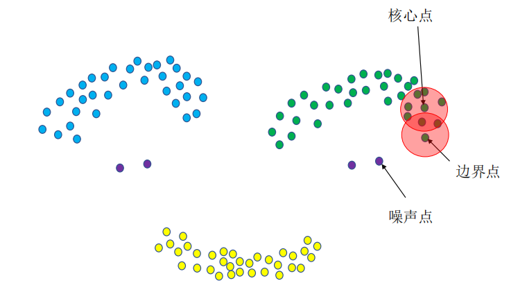
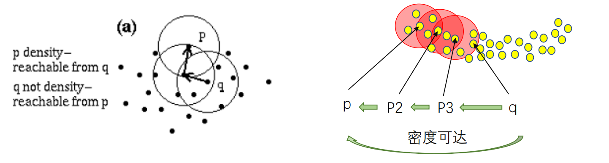
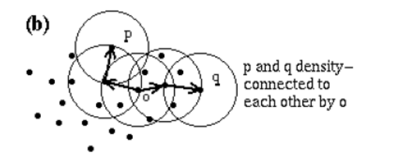
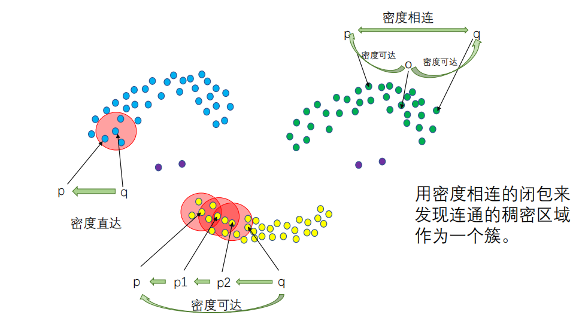
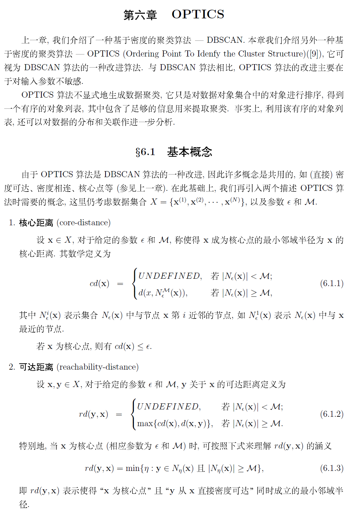
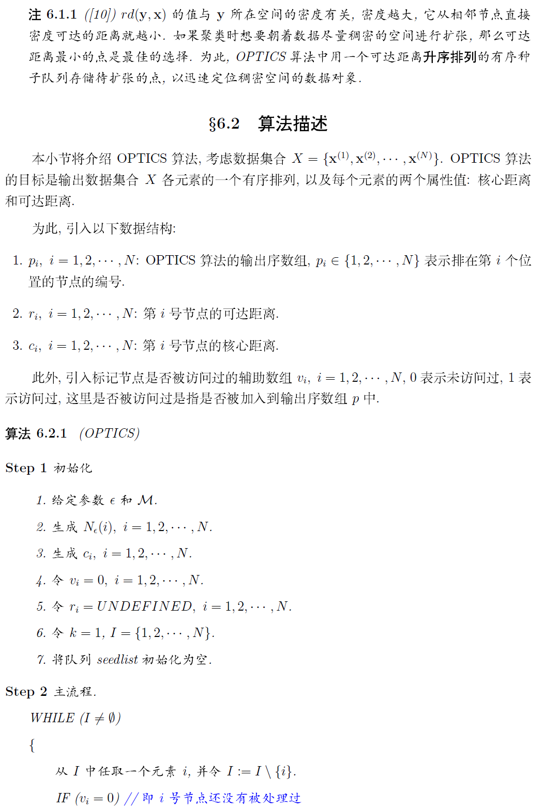
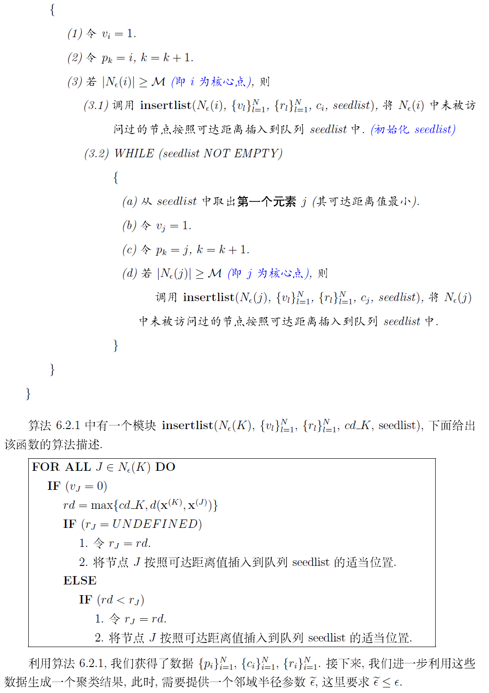
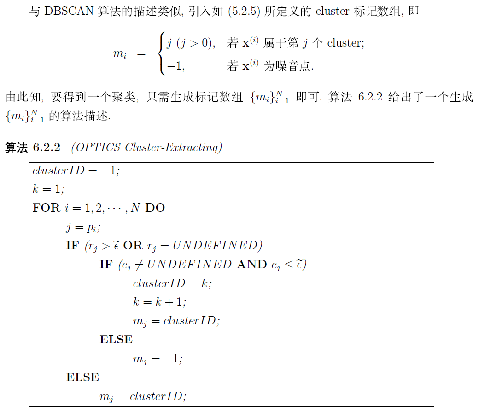
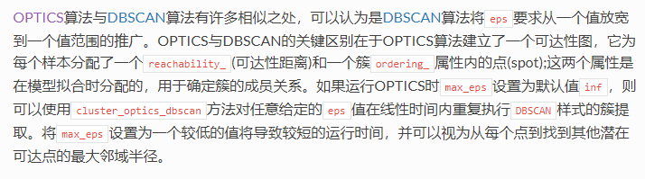

## 两个超参数

### eps

对于点p的$\epsilon$-领域，定义为$N_eps(p)$，其中$N_eps(p)={q \in D |dist(p,q) \leq eps}$。

$|N_eps(p)|$则定义为再p点的$\epsilon$-领域内点的个数（==包含p==）

dist()函数为计算两个点之间的距离的方法，可以为欧氏距离或者余弦距离

### MinPts

对于每一个$\epsilon$-领域内点的数量至少为MinPts个。若满足这个条件，则该点为核心点。

## 数据点的类别

- 核心点：其领域内的样本点的数量不少于MinPts。 

- 边界点：处于核心点的领域内，但其本身的领域内样本点的个数少于MinPts。 

- 噪声点：其领域内样本点的个数少于MinPts，且不处于核心点的领域内。

## 点与点之间的三种关系

### 1. 直接密度可达

若点p处于点q的$\epsilon$-领域中，且q为核心点，则称点p可由点q直接密度可达（密度直达）。==注意反之不一定成立==，若点p为边界点，则点q不能由点p直接密度可达。==是核心点到其领域内其他点的关系==

即：点p与q应满足一下两个条件

1. $p \in N_eps(q)$
2. $N_eps(q) \geq MinPts$

### 2. 密度可达

对于点$p$和点$q$,如果存在样本序列$p_1,p_2,\cdots,p_T$，满足$p_1 = p,p_T = q$, 且$P_{t-1}$由$p_t$密度直达，则称𝑝由𝑞密度可达，即密度可达满足传递性。此时序列中的传递样本$p_2,p_2,\cdots,p_{T-1}$均为核心对象，因为只有核心对象才能使其他样本密度直达.

注意密度可达也不满足对称性，这个可以由密度直达的不对称性得出。

### 3. 密度相连

对于p和q,如果存在核心对象样本点o，使点p和点q均由点o密度可达，则称p和q密度相连。注意密度相连关系是满足对称性的

## OPTICS

参考原文：https://blog.csdn.net/itplus/article/details/10089323

## DBSCAN与OPTICS比较

OPTICS 在DBSCAN 基础上改进的这一缺陷，该算法并不显式地产生数据集类簇，而是产生一个根据参数ε邻域、MinPts 计算一个增广的簇排序，这个排序包含的信息等价于从广泛的参数ε邻域、MinPts 的设置所获得的 DBSCAN 聚类结果

